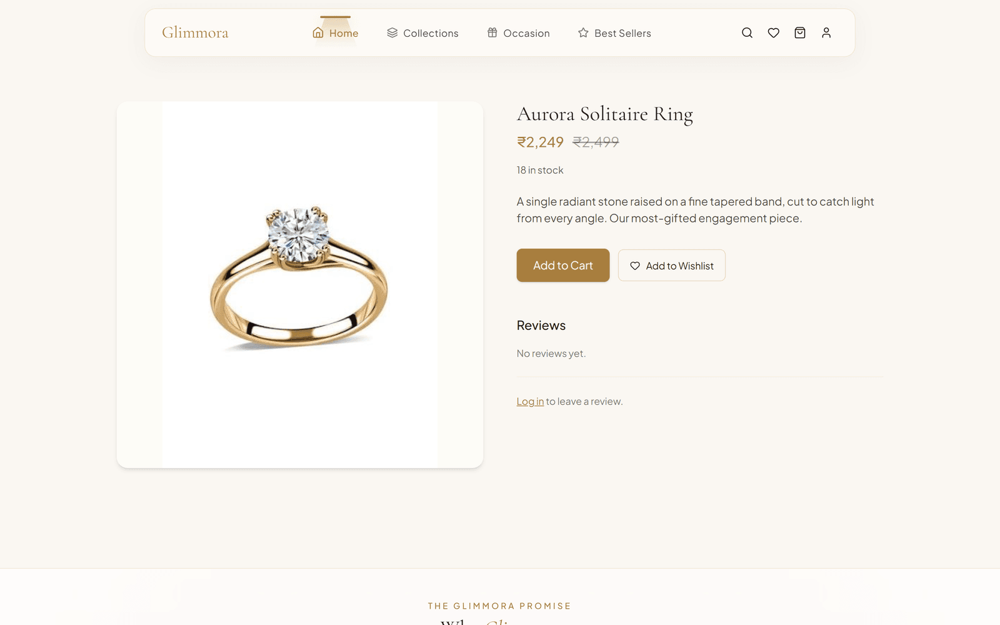
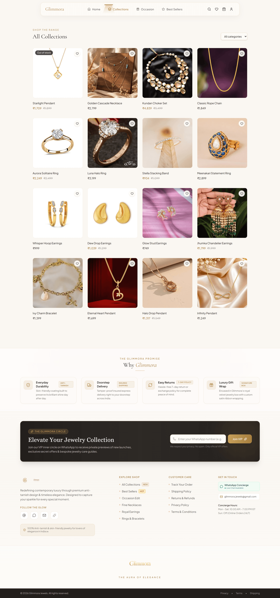
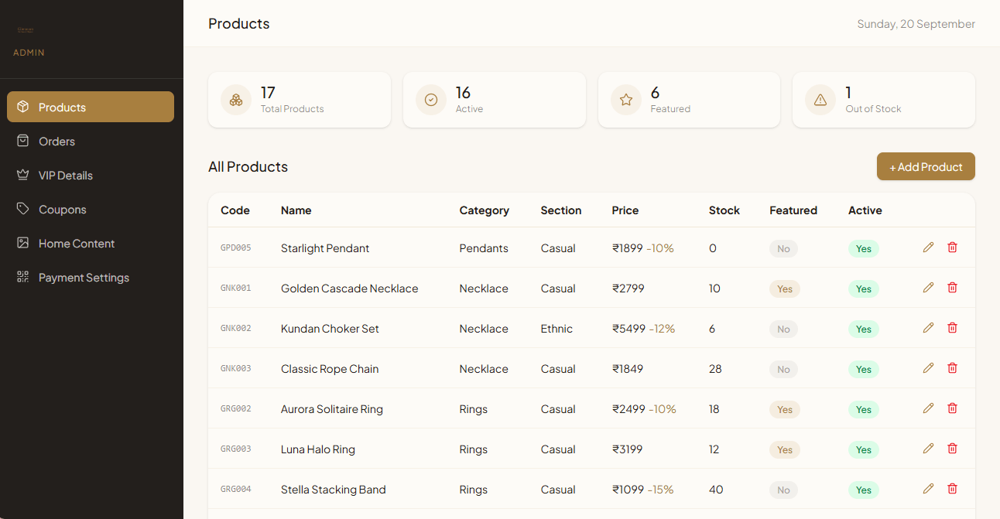
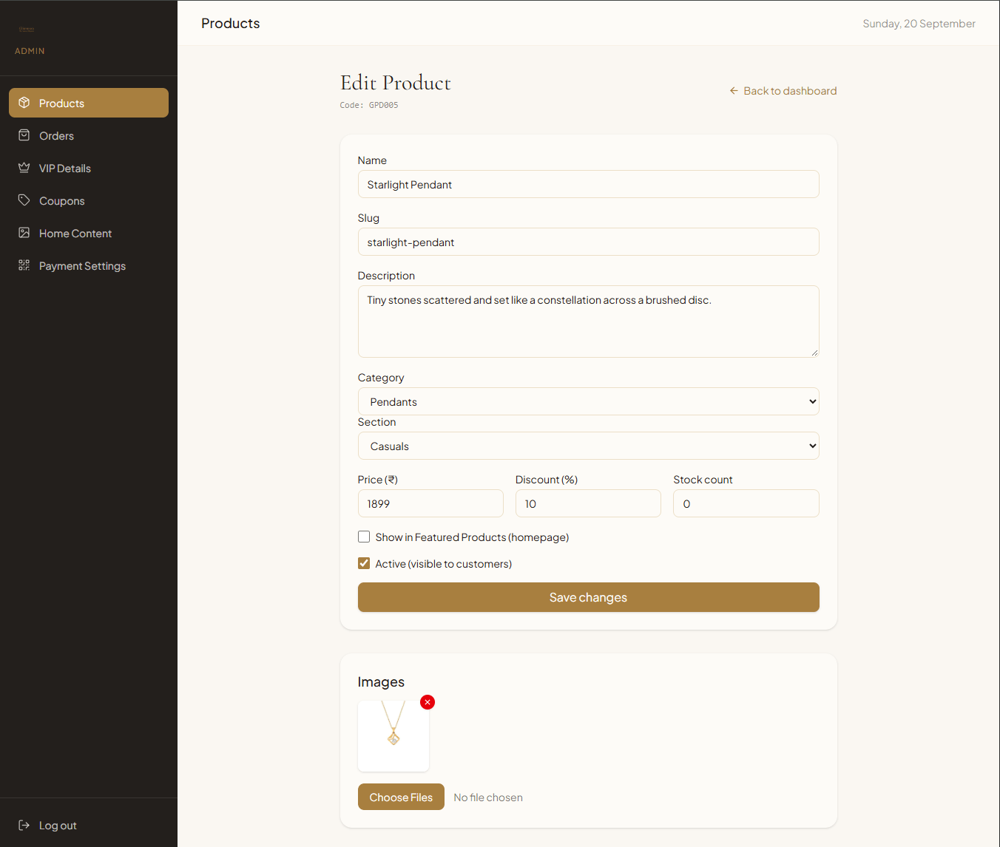

# Glimmora — The Aura of Elegance

A production-style jewellery storefront with a full admin CMS, built on React 19 and Supabase.
Customers browse by collection and occasion, build a cart and wishlist, apply coupons and
check out; the store owner manages the entire catalog, orders, coupons and homepage content
from an admin panel — no redeploy needed to change what the site sells or says.

**Live demo:** <https://glimmora-store.vercel.app>
**Admin panel:** `/admin/login` — credentials are not published, since an admin has full
write access to the live store. The dashboard screenshot below shows what it does.

> If the storefront looks empty, the free-tier Supabase project has auto-paused after a
> period of inactivity. The screenshots below show the app fully populated.

## Screenshots

### Storefront

The homepage opens on a pinned, scroll-driven story: five chapters in the life of a piece
(metal, craft, stone, finish, moment), each image pushing in and crossfading as you scroll
while its headline dissolves in over drifting gold dust, ending on the shop CTAs.


### Product detail

Live stock, per-product discounts struck through the original price, wishlist and reviews.



### Collections



### Admin dashboard

Catalog at a glance, with the auto-generated per-category product codes, the
Casual/Ethnic section split and live stock. Orders, coupons, homepage content and
payment settings sit alongside it.



### Admin product form

Full CRUD over the catalog: pricing and discount, stock, category and Casual/Ethnic
section, featured and active flags, and multi-image upload straight to Supabase Storage.
The product code (`GPD005`) is assigned by a database trigger, not entered by hand.



## What it does

**Storefront**
- Scroll-scrubbed cinematic hero (GSAP ScrollTrigger) with a still fallback for reduced-motion users
- The homepage stays dark from hero to footer; every section below the story is a 3D plane whose
  tilt is tied to scroll position, rising in, lying flat, then tipping away (and reversing on the way up)
- Oversized type bands that slide against the scroll, and category cards that tilt toward the cursor
- Inertial wheel scrolling across the storefront (Lenis), with native touch scrolling kept on phones
- Browse by category (`/collections/:slug`) and by occasion, plus a Casual/Ethnic section split
- Full-text product search across names and descriptions
- Cart and wishlist that survive a refresh, with wishlist synced to the signed-in account
- Coupon codes validated server-side before checkout
- Gift wrap option, per-product discounts, live stock awareness
- Reviews with a one-review-per-customer-per-product guarantee enforced in the database
- Policy pages (shipping, returns, privacy, terms) and a cookie consent banner

**Admin panel** (`/admin`, gated by an `admins` table — not a hardcoded role claim)
- Product CRUD with drag-ordered multi-image upload to Supabase Storage
- Order management with status transitions (Pending → Confirmed → Shipped → Delivered / Cancelled)
- Coupon creation with percent or fixed-amount discounts, expiry and per-user usage limits
- Homepage CMS: offer strip, hero banner, and a "Follow the Glow" gallery of photos, videos and Instagram posts that link out to Instagram
- Payment QR upload and VIP WhatsApp subscriber list

## Engineering notes

The parts that were more interesting than the CRUD:

- **Checkout is atomic and oversell-safe.** Order creation runs in a single Postgres function
  (`create_order`) that takes `FOR UPDATE` row locks on every product before validating stock,
  so two simultaneous checkouts can't both sell the last item. Order, line items and stock
  decrement commit together or not at all — a partial failure never leaves a half-created order.
- **Coupons are never trusted from the client.** The browser calls `validate_coupon` only to
  show feedback; `create_order` independently re-resolves the code, re-checks expiry and
  per-user usage, and recomputes the discount server-side. Both discount branches clamp to the
  subtotal, so a misconfigured coupon can't produce a negative total.
- **Row Level Security on all 14 tables.** Public read is limited to active catalog rows;
  customers reach only their own orders, wishlist and redemptions; writes are gated by an
  `is_admin()` `SECURITY DEFINER` helper. The anon key is public by design, so RLS — not the
  client — is the security boundary. Coupon codes are never exposed as a readable table.
- **Cancelled orders return their stock.** A trigger restores `stock_count` for every line item
  the first time an order transitions to `Cancelled`, so cancellations don't silently burn inventory.
- **Order invoices are private.** The generated PDFs contain a customer's name, address and
  phone, so they live in a non-public bucket and are shared only through short-lived signed
  URLs rather than permanent public links.
- **Human-readable identifiers.** Database triggers assign order numbers (`070826-A1B2`) and
  per-category product codes (`GER001`) on insert, with collision retry.
- **One homepage theme switch, no dark-mode forks.** Tailwind v4 reads theme colours from CSS
  variables, so the dark homepage is a single `.theme-noir` class that re-maps `cream`, `ivory`,
  `charcoal` and `gold-dark`. Every themed component flips with it; the few colours that must
  never flip (text over photos, always-dark panels) use fixed `pearl`/`onyx`/`ink` tokens instead.
- **Smooth scrolling that never traps the page.** Lenis runs in fixed-duration mode rather than
  lerp: lerp chases its target until rounded values match, which on a page with a fractional
  maximum scroll never happens, leaving Lenis "scrolling" forever and overriding the scrollbar and
  keyboard. A duration always completes.
- **WhatsApp notification degrades gracefully.** Checkout races the notification Edge Function
  against a 6-second timeout and falls back to a click-to-send link, so an undeployed or slow
  function can never stall or fail an order.

## Stack

React 19 · TypeScript · Vite 8 · Tailwind CSS 4 · React Router 7 · GSAP
Supabase (Postgres, Auth, Storage, Edge Functions)

## Running locally

```bash
npm install
cp .env.example .env    # then fill in your Supabase values
npm run dev
```

`.env` needs:

```
VITE_SUPABASE_URL=https://your-project-ref.supabase.co
VITE_SUPABASE_ANON_KEY=your-anon-public-key
VITE_ADMIN_WHATSAPP_NUMBER=91xxxxxxxxxx
```

### Backend setup

Paste [`supabase/setup.sql`](supabase/setup.sql) into the Supabase SQL Editor and run it once.
It creates every table, policy, trigger, function and storage bucket in one pass, and is safe
to re-run.

The numbered files beside it are the original incremental migrations, kept for history only —
they can no longer be replayed in filename order, because `create_order`'s return type changes
mid-chain and `CREATE OR REPLACE` cannot alter a return type. Use `setup.sql` for a new project.

Then, as printed at the end of that file:

1. Create an admin user under Authentication → Users, and insert its id into `admins`.
2. Enable the Phone provider for customer OTP login.
3. Optionally seed a catalog with [`supabase/seed_realistic_catalog.sql`](supabase/seed_realistic_catalog.sql).

## Deploying

Vercel picks up [`vercel.json`](vercel.json) as-is. Add the three `VITE_` variables in the
project's Environment Variables, then deploy. The config rewrites all paths to `index.html`
so client-side routes like `/product/aurora-solitaire-ring` survive a hard refresh.

## Project layout

```
src/
  pages/            storefront routes
  pages/admin/      admin panel (gated by AdminRoute)
  components/       shared UI, layout, product card
  lib/              Supabase client, Auth/Cart/Wishlist contexts, pricing helpers
supabase/
  setup.sql         consolidated schema — run this
  functions/        notify-order Edge Function
```
